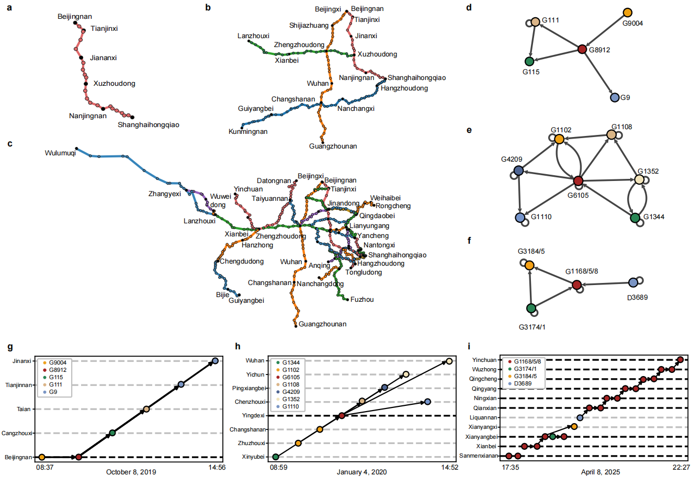

# Networked Train Delay Causality Inference

Source codes and data for our paper: Discovering train delay causality from the complex high-speed railway network.

Authors: XXX

##  Train Delay Causality Inference Framework for the Railway Network

This repository contains a Hawkes-Granger framework for inferring macro-level delayed train causality and micro-level delay event causality.

The source code is mainly implemented in Python.

## Requirements

This framework requires Python 3.7 or higher, as well as several common scientific computing libraries, as shown below. These libraries can be installed using pip or conda:

castle 6.1.0

gcastle 1.0.4

matplotlib 3.5.3

networkx 2.6.3

numba 0.56.4

numpy 1.21.6

pandas 1.3.5

pypinyin 0.54.0

scikit_learn 0.21.1

scipy 1.7.3

seaborn 0.12.2

You can also run `pip install -r requirements.txt` to install all dependencies.

## Data

### Synthetic Data

#### Experimental Datasets

The synthetic datasets SingleL and CrossL used in our paper for the experiments are shown in the `synthetic_data` folder, and the corresponding parameters for generating them are shown in `params.pk`. The ground truth for delayed train causality and delay event causality is shown in `G_V.pny` and `G_X.npy`.

The model used to generate the data is shown in the `model` folder.

The raw data used to generate these two datasets originated from https://doi.org/10.6084/m9.figshare.15087882.v4. 

#### Synthetic Data Generation

We provide a demo to generate the experimental datasets in the `demo` folder. You can execute the following command to generate a custom synthetic dataset：

`
python demo/generate_network_hawkes_data.py
`

Before generating the custom datasets, you need to first extract the target railway lines, their corresponding topology G_S, and train operation records from the raw data, and put them into the `raw_data` folder.

### Real-world Data
The real-world dataset Net used in our paper for the experiments is shown in the `real_data` folder. The ground truth for delayed train causality and delay event causality is shown in `G_V.pny` and `G_X.npy`.

The raw data are collected from the Lanzhou Railway Bureau dispatch centers from April 2, 2025, to April 23, 2025, which cannot be made public due to the confidentiality policies.

## Delay Causality Inference
Our proposed framework is shown in the `data` folder. We provide a demo to infer macro-level delayed train causality and micro-level delay event causality based on our framework in the `demo` folder. 

To perform inference, run:

`
python demo/gridsearch_CRTHG.py
`

You need to create a folder `result` to store the experimental results.

## Evaluation
To evaluate the inference performance of CRTHG based on TPR, FPR, AUROC and SHD, and assess the ability of the model to distinguish between initial and knock-on delays based on MAPE, run:

`
python utils/evaluate.py
`

